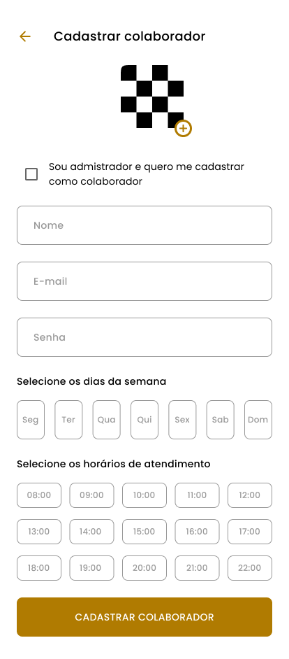

# Dart Week Barber Shop - Flutter

## Descrição do Projeto

Este repositório contém o código-fonte de um aplicativo desenvolvido durante a Dart Week 11. O objetivo do projeto é criar um aplicativo de agendamento de horários em barbearias, proporcionando uma maneira conveniente para os clientes agendarem seus cortes de cabelo.

## Screens

## Visão do Administrador

<div align="center" style="display: flex; flex-direction: row; flex-wrap: wrap; justify-content: center; align-items: center; align-content: center; gap: 10px;">
    
    
    
    
    
    
    
    
    
</div>

## Visão do Colaborador

<div align="center" style="display: flex; flex-direction: row; flex-wrap: wrap; justify-content: center; align-items: center; align-content: center; gap: 10px;">
    
    
    
    
</div>

## Como rodar a aplicação

### Pré-requisitos

- [Dart](https://dart.dev/get-dart)
- [Flutter](https://flutter.dev/docs/get-started/install)
- [Android Studio](https://developer.android.com/studio)
- [VSCode](https://code.visualstudio.com/)
- [Git](https://git-scm.com/)

### Rodando a aplicação

```bash
# Clone este repositório
$ git clone https://github.com/rafaelmachadobr/dw11-barbershop.git

# Acesse a pasta do projeto no terminal/cmd
$ cd dw11-barbershop

# Instale as dependências
$ flutter pub get

# Execute a aplicação em modo de desenvolvimento
$ flutter run
```

### Tecnologias utilizadas:

- Dart
- Flutter

## Licença

Este projeto esta sobe a licença MIT. Consulte a [LICENÇA](LICENSE) para saber mais.
